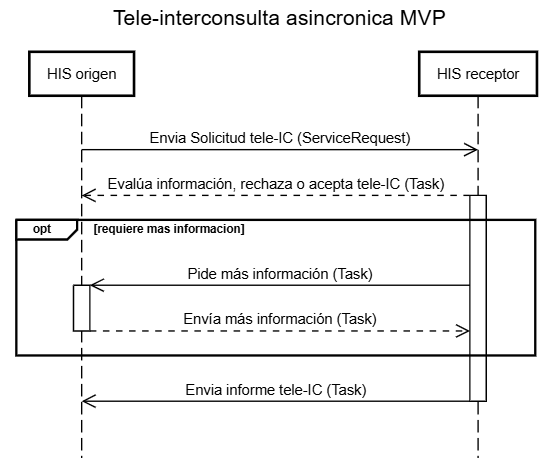

### Operaciones 

#### Operaciones de Teleinterconsulta Transfronteriza

El siguiente diagrama de secuencia describe las operaciones generales para el caso de TeleInterconsulta Transfronteriza asi como tambien los principales recursos involucrados.
 

   
  
Diagrama de Secuencia TICTF

 

Asímismo el siguiente diagrama ilustra el caso en el cual la TeleInterconsulta Transforonteriza es rechazada:

 

   
  
Diagrama de Secuencia TICTF rechazada

 